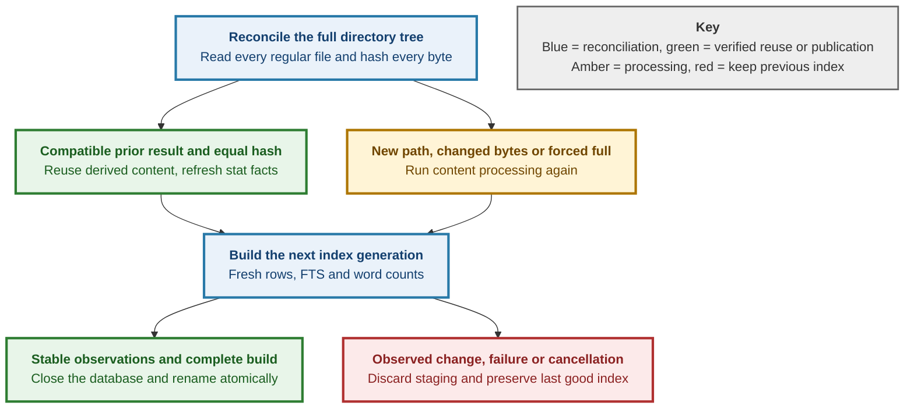

# ADR 0012 — Directory content reuse

<b>BACKUPSAGE · DIRECTORY RECONCILIATION</b>

## Read the bytes. Reuse the work.

Re-indexing a folder can reuse image analysis and retained text after proving
that the complete file content still matches. A new index replaces the old one
only after the scan completes and the source passes stability checks.

<b>DONE IN THIS DIFF</b> — full-content verification, fresh directory membership,
conservative result reuse, forced full processing and last-good preservation.

<b>WATCH</b> — every file is still read. Before/after stat detects observed
instability; a live filesystem is not an atomic snapshot.

<b>OPEN</b> — independent review, committed mutation proofs and future watcher
acceleration. This lane does not close roadmap parent #25.

PROPOSED · #25 · B4 · codex · 2026-09-26

## Context and decision

PDF: **RENDER PENDING (max renders)** — Chromium failed to start in this sandbox; final layout and diagram remain unverified.

Status: proposed. Decider: Max at review and landing. Related issue:
[BackupSage #25](https://github.com/tom2025b/BackupSage/issues/25).

A file can change without changing its size or recorded mtime. A directory's
own mtime says nothing about rewrites inside its descendants. Watcher streams
can miss events, so none of those signals establishes unchanged content.

Always reconcile the complete namespace and read every regular file to EOF.
When a previous full-mode index has compatible processing metadata, compare
its full BLAKE3 hash with the newly computed hash. Equal hashes permit reuse of
content-derived results at the exact same raw path; fresh stat data supplies
size, mtime and mode. Added and renamed paths are processed normally. Paths deleted before the scan are absent from the fresh generation. A path
that disappears between the walk and its per-entry stat is retained as a
name-only degraded row with the stat error. Replacements are read even when
their names, sizes and mtimes match the old file.

The old index is read through the existing locked reader and checked for
coherence before promotion. The new database is built independently, including
FTS rows and rebuilt word statistics. Its UUID identifies the new generation.
The existing close-then-rename promotion remains the only publication step.

The implementation emits a full-subtree rescan explanation. It does not promise
that unchanged files avoid disk reads, tokenization or SQLite writes. The gain
is avoiding repeated content classification and image/EXIF/pHash processing,
and reusing stored text derivation. No benchmark speedup is claimed.

## Compatibility and alternatives

The additive v3 meta key `directory_reuse_version=1` identifies compatible
content derivation. Bump this version whenever that derivation changes.
`directory_files_reused` records the number of content-verified reused results;
`IndexSummary.files_reused` exposes the same count. Existing readers ignore
these additive keys. `IndexOptions.force_full` and CLI `index --force-full`
bypass all reuse without changing the content mode or retention caps.

Cache eligibility requires completed schema v3, directory source, full mode,
BLAKE3, matching pHash algorithm and text/media caps, and the reuse version.
Missing or incompatible metadata causes fresh processing of the whole subtree.
Search-only must regenerate content tokens because it stores no plaintext.
Metadata-only continues to avoid reading content and makes no content-equality
claim. Word-statistics options may change because aggregates are regenerated.
Read/decode errors, unknown flags or unusable rows are retried, not reused.

Metadata-only skipping would save I/O but can miss same-size/same-mtime edits.
Watcher-only skipping would save traversal but needs overflow, unsupported-FS
and recovery handling; it is deferred to a separate roadmap child. Always
reprocessing everything is authoritative and available through `--force-full`.
The chosen middle ground verifies all bytes and reuses only proven results.

## Stability and limits

The initial and final namespace observations include directory entries, exact
paths, device/inode, size, mode, link count, and nanosecond mtime/ctime. Each
opened regular file is checked against the initial observation before processing
and against both its descriptor and pathname after processing. A mismatch fails
with an unstable-source diagnostic and preserves the previous completed index.
Cancellation retains the same last-good behavior and staged-file cleanup.

Repair round 1 restores per-entry degradation before content processing. A
failed stat or open emits a warning and records a name-only row with READ_ERROR,
no content hash and no reusable result. FIFOs, sockets and devices are skipped
with their type before any content open. A regular-file open uses O_NONBLOCK
and O_NOFOLLOW and rechecks the opened handle, so a raced-in FIFO cannot hang.
The path is retried on the next scan; even a previously readable cached row
cannot authorize reuse when the current entry is unreadable.

The existing v3 entry-type contract stays intact: degraded entries use file /
binary with READ_ERROR. Additive meta keys `directory_entry_issue:<files.id>`
store JSON containing `path`, optional raw path bytes as `path_raw`, observed
`type` and `reason`. This preserves the exact error and special-file type
without making older coverage/diff readers reject a new entry-type enum.

Reconciliation exempts only explicitly degraded paths from content-stability
comparison. Their parent directories may change size and membership timestamps,
but must retain device, inode, mode and link count; all other entries still
must match. This lets a vanished entry be recorded while another file's change
or an unrelated addition still prevents promotion. Directory traversal failures,
Borg guards and instability of successfully read files still abort safely.

These checks detect observed changes; they do not freeze a live filesystem.
An uncooperative filesystem can conceal changes, and changes after final
observation belong to the next scan. Use an immutable filesystem snapshot when
a single atomic source state is required. Unreliable timestamps never justify
content reuse: full hashing is always performed. No watcher cursor or dirty-path
state exists, so every invocation takes the conservative reconciliation path.
A future watcher optimization must preserve this authoritative fallback.

The namespace observations require memory proportional to the number of entries.
FTS and statistics are rebuilt, so text-heavy trees may see limited improvement.
The old and staged databases coexist until promotion and need corresponding disk
space. This lane makes no watcher, performance or parent-milestone exit claim.

## Validation and review

Regression coverage compares incremental and forced-full file rows, FTS content,
word counts and completion counters. Fixtures cover unchanged media/text/binary,
same-size restored-mtime rewrites and replacements, edits past retention caps,
create/rename/delete/hardlink/permission changes, clock rollback, raw path bytes,
mode/cap changes, legacy cache metadata, cancellation and pre-promotion mutation.
Repair regressions add permission-denied content (skip only when root), a FIFO
without a writer under a five-second process timeout, deterministic deletion
between walk and stat, a FIFO swapped in after stat with a three-second receive
timeout, and unrelated content/namespace changes alongside degraded entries.

Run the unfiltered workspace tests, all-target clippy with warnings denied and
format checks under B4's locked build environment. REPORT.md records actual
counts and outcomes. Max must commit before running the two exact Failure Atlas
mutations listed there; only actual caught verdicts are proof. No mutation
verdict, independent review, merge or deployment is claimed by this ADR.

last_edited_by: codex  
**Signed:** codex · 2026-09-26T22:43:33-04:00
